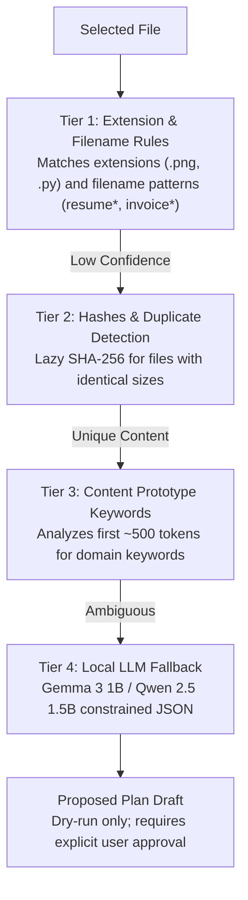
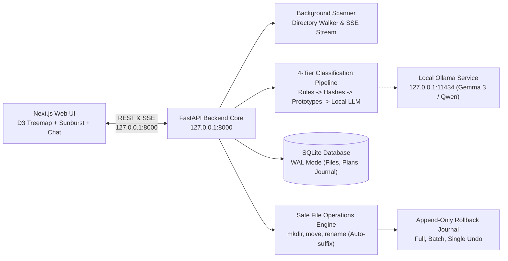

<div align="center">

# FolderPilot

**Organize anything. Delete nothing.**

Privacy-first, local folder organizer with interactive visual analytics,<br/>
append-only rollback journaling, and on-device AI.

<br/>


[Overview](#why-this-exists) · [How it works](#how-it-works) · [Features](#features) · [Safety model](#safety-model) · [Quick start](#quick-start)

</div>

---

## Why this exists

Personal directories such as Downloads, Desktop, and work folders routinely accumulate sensitive files—including tax returns, identity cards, college transcripts, and resumes. Most of these files remain disorganized because manual sorting is slow and tedious.

Typical cloud organizers require uploading private documents to external servers. Other utility scripts use aggressive delete operations that risk permanent data loss.

FolderPilot runs entirely on local hardware, inspects documents privately on `127.0.0.1`, and guarantees that no file can ever be deleted.

---

## Why open-source, local AI

Running open-weight language models locally on consumer hardware changes the economics and security of desktop file management:

| Dimension | Local Open-Source AI (FolderPilot) | Cloud AI APIs |
|---|---|---|
| **Privacy** | Local-only. File contents, extracted text, and metadata never leave `127.0.0.1`. | Documents, filenames, and text excerpts are transmitted over the internet to remote servers. |
| **Cost** | Zero marginal cost per file. Runs on available CPU and RAM. | Metered API pricing that scales with document volume and token counts. |
| **Offline use** | Fully operational without an internet connection once weights are cached. | Inoperable during network outages or when working in disconnected environments. |
| **Model choice** | Open weights (defaults to Gemma 3 1B with Qwen 2.5 1.5B fallback). User can switch models freely. | Locked to a single provider's proprietary API, rate limits, and deprecation schedules. |
| **Adaptability** | Manual category overrides are stored in local SQLite to guide future scans. | Generic prompt adaptation with no local ownership of model behavior. |
| **Accuracy tradeoff** | Smaller 1B–1.5B models may misclassify ambiguous files. Mitigated by explicit review queues. | Higher zero-shot accuracy, but accompanied by data exposure and recurring API costs. |

---

## How it works

FolderPilot organizes directories using a 4-tier hierarchical classification pipeline. Inexpensive deterministic checks run first, reserving local LLM inference only for ambiguous files.



| Pipeline Tier | Primary Mechanism | Target File Types | Scope |
|---|---|---|---|
| **Tier 1: Rules** | Extension taxonomy and regex keyword matching | Code, archives, images, media, common filenames (`screenshot`, `resume`) | Majority of standard files |
| **Tier 2: Hashes** | Lazy SHA-256 hashing for files sharing identical byte sizes | Duplicate documents, repeated downloads, installer copies | Identical content files |
| **Tier 3: Prototypes** | Keyword frequency checks in first ~500 extracted tokens | Academic assignments, invoices, tax receipts, offer letters | Text-rich documents |
| **Tier 4: Local LLM** | Ollama constrained JSON schema classification | Ambiguous PDFs, poorly named reports, multi-topic text files | Ambiguous fallback files |

---

## Features

- **Visualizations**: Interactive D3 Treemap with drill-down navigation and spotlight search; DaisyDisk-style concentric Sunburst view; side-by-side Before/After comparison tree.
- **Chaos score**: Algorithmic disorder metric (0 to 100) factoring root clutter, deep nesting imbalances, and duplicate ratios; interactive slider to simulate cleanup progress in real time.
- **Duplicate clusters**: Identifies identical files via lazy SHA-256 hashing; groups duplicates with keep-original and keep-newest recommendations.
- **Folder chat**: Local conversational interface powered by SQLite schema introspection and local LLM reasoning; includes built-in refusal for destructive commands.
- **Previewer**: In-app viewer supporting images, video, audio streaming, PDF text extraction via PyMuPDF, formatted Word/PowerPoint documents, spreadsheets, and hex dump inspection.
- **Journal and undo**: Append-only transaction log recording operations before disk execution; supports single-operation, batch, or complete workspace rollbacks.
- **WanderingEyes scanner**: Centered animated scanner tracking live progress, file counters, data volume, currently processed file ticker, and background scan cancellation.

---

## Safety model

The core design principle of FolderPilot is non-destructive operation by construction. Dangerous operations do not exist in the codebase.

| Guarantee | Technical Implementation | Verified Test Reference |
|---|---|---|
| **No deletion** | No `delete`, `unlink`, `remove`, or file truncation code paths exist in the filesystem operations engine. Cleanup suggestions move files to `_Review_Later/`. | [`tests/test_safe_ops.py::test_no_delete_functions_exist`](backend/tests/test_safe_ops.py) |
| **No overwrite** | Name collisions are resolved by auto-suffixing destination filenames: `name (1).ext`. | [`tests/test_safe_ops.py::test_auto_suffix_collision`](backend/tests/test_safe_ops.py) |
| **Approval first** | Plans are generated in an unapproved draft state (`approved = false`). No file on disk is modified without explicit confirmation. | [`tests/test_planner.py::test_plan_and_dryrun`](backend/tests/test_planner.py) |
| **Reversible operations** | Every file operation writes an atomic journal entry prior to execution, enabling single-operation, batch, or workspace-wide rollbacks. | [`tests/test_journal_undo.py::test_journal_and_undo`](backend/tests/test_journal_undo.py) |
| **Protected system paths** | Critical operating system folders (`C:\Windows`, `C:\Program Files`, root system drives) are rejected by folder browser guards. | [`tests/test_folder_browser.py::test_protected_path_block`](backend/tests/test_folder_browser.py) |
| **Local-only binding** | Backend server binds strictly to `127.0.0.1` and initiates no outbound internet traffic. | [`tests/test_folder_browser.py::test_symlink_escape`](backend/tests/test_folder_browser.py) |
| **Chat refusal guard** | Conversational chat router intercepts requests attempting deletion or removal and issues a safety refusal notice. | [`tests/test_chat_engine.py::test_chat_delete_refusal`](backend/tests/test_chat_engine.py) |

---

## Models

FolderPilot defaults to **Gemma 3 (1B)** (`gemma3:1b`) for on-device inference, with built-in support for **Qwen 2.5 (1.5B)** (`qwen2.5:1.5b`).

To specify the default model via environment variable:
```bash
set FOLDERPILOT_OLLAMA_LLM_MODEL=gemma3:1b
```

You can also change the active model at runtime using the model selector in the top navigation bar or through the `POST /api/ai/model` endpoint.

Hardware requirements: Standard multi-core CPU and 8 GB RAM. A dedicated GPU is not required.

| Model | Parameters | Quantization | Footprint | Best For |
|---|---|---|---|---|
| **Gemma 3 1B** (Default) | ~1B | Q4_K_M | ~1.2 GB RAM | Fast CPU categorization, low memory systems |
| **Qwen 2.5 1.5B** | 1.5B | Q4_K_M | ~1.6 GB RAM | Complex text reasoning, multi-language documents |

---

## Tech stack

| Layer | Technologies |
|---|---|
| **Frontend** |     |
| **Backend** |    |
| **Local AI** |    |
| **Extraction** |    |

---

## Architecture



---

## Quick start

### Prerequisites
- **Python**: 3.11 or later
- **Node.js**: 20 or later (required by Next.js 16)
- **Ollama**: Installed from [ollama.com](https://ollama.com) (for local AI features)

Pull the supported local models:
```bash
# Recommended default model
ollama pull gemma3:1b

# Alternative model
ollama pull qwen2.5:1.5b
```

---

### Option A: Windows Launcher
Run the batch script from the repository root:
```cmd
.\run.bat
```
The script validates the Python and Node.js environments and starts the FastAPI backend and Next.js frontend in separate terminal windows.

---

### Option B: Manual Setup

#### 1. Backend Server
```bash
cd backend
python -m pip install -r requirements.txt
python -m uvicorn app.main:app --host 127.0.0.1 --port 8000 --reload
```
Interactive API documentation is accessible at `http://127.0.0.1:8000/docs`.

#### 2. Frontend Application
```bash
cd frontend
npm install
npm run dev -- -p 3000
```
Open `http://127.0.0.1:3000` in your browser.

---

## Testing

FolderPilot includes an automated test suite verifying non-destructive operations, path validation, duplicate hashing, and rollback journaling.

### Run Backend Tests
```bash
cd backend
pytest -v
```

All 19 automated unit and integration tests pass:
- `tests/test_ai_ollama.py` (3 tests: status, model switching, summarization)
- `tests/test_chat_engine.py` (2 tests: deletion refusal, count queries)
- `tests/test_classifier.py` (4 tests: extensions, keywords, prototypes, sensitive data)
- `tests/test_folder_browser.py` (4 tests: drive listing, system path guards, symlink escapes, path sanitization)
- `tests/test_journal_undo.py` (1 test: atomic journaling and undo)
- `tests/test_planner.py` (1 test: plan generation and dry-run invariant)
- `tests/test_safe_ops.py` (4 tests: zero-delete invariant, collision auto-suffixing, safe moves, safe renames)

### Build Frontend
Validate the Next.js production build:
```bash
cd frontend
npm run build
```

---

## Repository structure

```
FolderPilot/
├── backend/                  # FastAPI Python backend engine
│   ├── app/                  # Application source code
│   │   ├── config.py         # Settings & environment overrides
│   │   ├── database.py       # SQLite connection manager & migrations
│   │   ├── models.py         # Pydantic request & response schemas
│   │   ├── main.py           # FastAPI routes & lifecycle handlers
│   │   ├── scanner.py        # Background scanner & SSE progress hub
│   │   ├── classifier.py     # 4-tier classification pipeline
│   │   ├── chaos_score.py    # Algorithmic disorder scoring engine
│   │   ├── planner.py        # Plan generation & dry-run simulation
│   │   ├── safe_ops.py       # Non-destructive file ops (mkdir, move, rename)
│   │   ├── journal.py        # Append-only rollback journal & undo engine
│   │   ├── folder_browser.py # System directory browser with path guards
│   │   ├── sensitive.py      # Sensitive document pattern detection
│   │   ├── chat_engine.py    # Conversational router & SQLite memory
│   │   └── ollama_client.py  # Local Ollama client (Gemma 3 / Qwen)
│   ├── tests/                # Automated pytest unit & integration test suite
│   └── requirements.txt      # Python dependencies
│
├── frontend/                 # Next.js 16 App Router frontend client
│   ├── src/
│   │   ├── app/              # Next.js App Router entry & page layouts
│   │   ├── components/       # Visualizations, modals, and navigation
│   │   │   ├── TreemapView.jsx           # D3 Treemap with drill-down zoom
│   │   │   ├── DaisyDiskSunburstView.jsx # Multi-ring polar sunburst
│   │   │   ├── BeforeAfterTreeView.jsx   # Split-tree comparison
│   │   │   ├── WanderingEyes.jsx         # Animated scanner hero
│   │   │   ├── FilePreviewModal.jsx      # Multi-format previewer & summary
│   │   │   ├── ChatDrawer.jsx            # Conversational chat panel
│   │   │   ├── Navbar.jsx                # Chaos gauge & live AI model selector
│   │   │   ├── CommandPaletteModal.jsx   # Spotlight filter (Ctrl+K)
│   │   │   ├── DuplicateClustersView.jsx # Duplicate diff & recommendations
│   │   │   ├── JournalHistoryView.jsx    # Audit journal & 1-click undo
│   │   │   ├── PlanReviewModal.jsx       # Dry-run review & approval drawer
│   │   │   └── StatsOverview.jsx         # Summary metrics & category breakdown
│   │   ├── utils/            # Byte formatters, colors, and helpers
│   │   └── api.js            # Client HTTP API layer
│   ├── next.config.mjs       # Next.js configuration & backend proxy rewrites
│   └── package.json          # Node dependencies & build scripts
│
├── docs/                     # Technical specifications & documentation
│   ├── ARCHITECTURE.md       # Architectural specifications & schema design
│   ├── REQUIREMENTS_SRS.md   # Functional requirements specification (FR-01 to FR-103)
│   ├── AI_INTEGRATION.md     # Local Ollama integration manual
│   ├── API_REFERENCE.md      # REST & SSE endpoint reference
│   └── DEVELOPMENT_LOGS.md   # Engineering history & milestones
│
├── .gitignore                # Git ignore rules
├── LICENSE                   # MIT License
├── README.md                 # Project overview & documentation
└── run.bat                   # Windows local launcher script
```

---

## Limitations and roadmap

### Current Limitations
- **Small-model accuracy on text-sparse files**: Lightweight 1B–1.5B parameter models can misclassify files with little or no extracted text. The dry-run approval queue catches these cases before changes are applied.
- **Regional language support**: OCR and prototype keyword parsing are currently optimized for English documents. Content in Indic scripts (e.g., Hindi, Marathi) requires additional language model and OCR tuning.
- **Large directory indexing**: Directories containing tens of thousands of files require longer initial scanning times during deep recursive walks.

### Roadmap
1. Integrate native ONNX runtime embeddings for local semantic vector search across personal notes.
2. Add multi-language OCR models for regional documents and identity cards.
3. Introduce an in-app custom taxonomy editor allowing users to define custom category rules and subfolder schemas.
4. Package the application as a standalone desktop executable (Tauri or Electron wrapper) with an embedded Python runtime.

---

## Contributing

Contributions and issue reports are welcome.

1. Fork the repository.
2. Create a feature branch: `git checkout -b feature/your-feature`.
3. Commit your changes: `git commit -m "feat: description of change"`.
4. Verify tests pass: run `pytest` in `backend/` and `npm run build` in `frontend/`.
5. Push to your branch and submit a pull request.

---

## License

Distributed under the **MIT License**. See [`LICENSE`](LICENSE) for terms.
