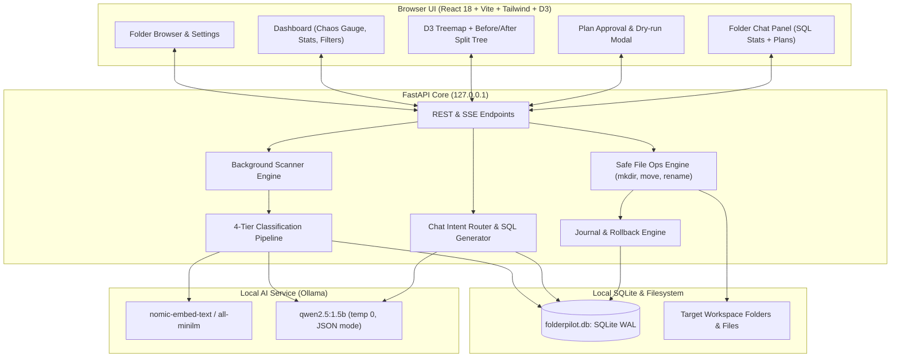

# FolderPilot — Technical Specification & Architecture Design
**Author:** The Product Manager (@pm)  
**Status:** Ready for Review & Approval  
**Target Delivery Stack:** FastAPI (Python 3.11+) + SQLite WAL + React (Vite + Tailwind + D3) + Ollama  
**Target Environment:** Local PC (Ryzen 3, 8 GB RAM, CPU-only, Windows 10/11)

---

## 1. System Overview & Invariants

FolderPilot is an offline, local-first folder intelligence and reorganization application. It ingests an unorganized directory, indexes and classifies files via a hierarchical 4-tier pipeline, visually presents proposed organization structures, and executes operations with a strict zero-data-loss guarantee.

### 🛡️ Ironclad Invariants
1. **Zero Deletion & Zero Overwrite**: Under no condition does the codebase contain or expose an `unlink`, `remove`, `delete`, or truncate operation for user files.
2. **Deterministic Auto-Suffixing**: When destination target collisions occur, the engine strictly applies counter suffixes (`filename (1).ext`).
3. **Explicit User Gate**: No file on disk is modified without explicit user approval. Default state of all proposed operations is unapproved (`approved = false`).
4. **100% Reversibility (Atomic Journaling)**: Every single filesystem change writes an append-only journal record before execution, enabling instant single-op, batch, or total rollback.
5. **Air-Gapped Privacy**: Zero network communication outside of `127.0.0.1`.

---

## 2. System Architecture



---

## 3. Database Schema (SQLite)

```sql
-- Workspaces
CREATE TABLE workspaces (
    id TEXT PRIMARY KEY,
    root_path TEXT NOT NULL UNIQUE,
    created_at TIMESTAMP DEFAULT CURRENT_TIMESTAMP,
    read_only BOOLEAN DEFAULT 0,
    settings_json TEXT DEFAULT '{}'
);

-- Indexed Files
CREATE TABLE files (
    id TEXT PRIMARY KEY,
    workspace_id TEXT NOT NULL REFERENCES workspaces(id) ON DELETE CASCADE,
    path TEXT NOT NULL,
    name TEXT NOT NULL,
    ext TEXT NOT NULL,
    size INTEGER NOT NULL,
    mtime REAL NOT NULL,
    ctime REAL NOT NULL,
    mime TEXT,
    sha256 TEXT,
    phash TEXT,
    text_snippet TEXT,
    embedding_blob BLOB,
    status TEXT DEFAULT 'indexed',
    UNIQUE(workspace_id, path)
);

-- File Classifications
CREATE TABLE classifications (
    file_id TEXT PRIMARY KEY REFERENCES files(id) ON DELETE CASCADE,
    category TEXT NOT NULL,
    subfolder TEXT,
    confidence REAL NOT NULL,
    tier INTEGER NOT NULL, -- 1: Rules, 2: Hashes, 3: Embeddings, 4: LLM
    reason TEXT NOT NULL,
    is_sensitive BOOLEAN DEFAULT 0,
    suggested_name TEXT,
    user_override BOOLEAN DEFAULT 0
);

-- Duplicate Groups
CREATE TABLE dup_groups (
    id TEXT PRIMARY KEY,
    workspace_id TEXT NOT NULL REFERENCES workspaces(id) ON DELETE CASCADE,
    kind TEXT NOT NULL, -- 'exact', 'near', 'image'
    keep_file_id TEXT REFERENCES files(id)
);

CREATE TABLE dup_members (
    group_id TEXT NOT NULL REFERENCES dup_groups(id) ON DELETE CASCADE,
    file_id TEXT NOT NULL REFERENCES files(id) ON DELETE CASCADE,
    PRIMARY KEY (group_id, file_id)
);

-- Plans & Operations
CREATE TABLE plans (
    id TEXT PRIMARY KEY,
    workspace_id TEXT NOT NULL REFERENCES workspaces(id) ON DELETE CASCADE,
    created_at TIMESTAMP DEFAULT CURRENT_TIMESTAMP,
    status TEXT DEFAULT 'draft' -- 'draft', 'approved', 'applied', 'undone'
);

CREATE TABLE ops (
    id TEXT PRIMARY KEY,
    plan_id TEXT NOT NULL REFERENCES plans(id) ON DELETE CASCADE,
    type TEXT NOT NULL, -- 'MKDIR', 'MOVE', 'RENAME'
    src TEXT NOT NULL,
    dst TEXT NOT NULL,
    approved BOOLEAN DEFAULT 0,
    status TEXT DEFAULT 'pending', -- 'pending', 'applied', 'skipped', 'failed'
    error TEXT
);

-- Append-Only Execution Journal
CREATE TABLE journal (
    id TEXT PRIMARY KEY,
    op_id TEXT NOT NULL REFERENCES ops(id),
    workspace_id TEXT NOT NULL REFERENCES workspaces(id),
    type TEXT NOT NULL,
    src TEXT NOT NULL,
    dst TEXT NOT NULL,
    hash_before TEXT,
    hash_after TEXT,
    ts TIMESTAMP DEFAULT CURRENT_TIMESTAMP,
    undone_at TIMESTAMP
);

-- User Corrections for KNN Active Learning
CREATE TABLE corrections (
    id TEXT PRIMARY KEY,
    workspace_id TEXT NOT NULL REFERENCES workspaces(id),
    file_id TEXT NOT NULL,
    from_category TEXT NOT NULL,
    to_category TEXT NOT NULL,
    ts TIMESTAMP DEFAULT CURRENT_TIMESTAMP
);

-- User-Defined Rules
CREATE TABLE rules (
    id TEXT PRIMARY KEY,
    workspace_id TEXT NOT NULL REFERENCES workspaces(id),
    pattern TEXT NOT NULL,
    target_folder TEXT NOT NULL,
    priority INTEGER DEFAULT 0
);

-- Chat History
CREATE TABLE chat_messages (
    id TEXT PRIMARY KEY,
    workspace_id TEXT NOT NULL REFERENCES workspaces(id),
    role TEXT NOT NULL, -- 'user', 'assistant', 'system'
    content TEXT NOT NULL,
    tool_calls_json TEXT,
    ts TIMESTAMP DEFAULT CURRENT_TIMESTAMP
);
```

---

## 4. Multi-Tier Classification Pipeline

| Tier | Technique | Triggers | Latency / File | Output |
| :--- | :--- | :--- | :--- | :--- |
| **Tier 1: Rules** | Extension maps, filename patterns, regex | All files | < 0.1 ms | Category, confidence 0.85-0.95 |
| **Tier 2: Hashes** | SHA-256 (size matches) & pHash for images | Size duplicates & images | 1 - 10 ms | Duplicate groups, keep recommendations |
| **Tier 3: Prototypes** | PyMuPDF / docx text snippet + cosine similarity | Documents, unclassified files | 10 - 50 ms | Content category, confidence 0.70-0.90 |
| **Tier 4: Small LLM** | Ollama `qwen2.5:1.5b` with JSON schema output | Confidence < 0.65 only | 1 - 3 s (CPU) | Subfolder, semantic name, reason |

### Sensitive Document Detection
A lightweight regex and keyword filter automatically scans extracted text snippets for sensitive identifiers (PAN cards, Aadhaar numbers, Passport numbers, bank account/IFSC patterns, marksheets). Any positive match automatically flags `is_sensitive = 1` and routes the destination folder to `Private/` with a locked visual indicator.

---

## 5. API Specification (`127.0.0.1:8000`)

| Endpoint | Method | Input | Output / Effect |
| :--- | :--- | :--- | :--- |
| `/fs/browse` | GET | `?path=` | Lists folders/drives, filters system-protected roots |
| `/workspaces` | POST | `{ "path": str, "read_only": bool }` | Initializes/opens workspace |
| `/workspaces/{id}/scan` | POST | `{ "recursive": bool, "depth": int }` | Triggers background scanner job |
| `/jobs/{id}` | GET | SSE stream | Emits `{ files_seen, bytes_processed, current_file, eta }` |
| `/workspaces/{id}/stats` | GET | - | Total files, total bytes, category breakdown, Chaos Score |
| `/workspaces/{id}/tree` | GET | `?view=current\|proposed` | Hierarchical JSON tree for D3 Treemap & Tree views |
| `/workspaces/{id}/duplicates`| GET | - | Clustered duplicates with keep recommendations |
| `/workspaces/{id}/plan` | POST | - | Generates proposed Plan (`MKDIR`, `MOVE`, `RENAME`) |
| `/plan/{id}/ops` | PATCH | `{ "op_ids": [...], "approved": bool }` | Updates approval state |
| `/plan/{id}/dryrun` | GET | - | Conflict check, space summary, locked files report |
| `/plan/{id}/apply` | POST | - | Executes approved ops, writes journal, returns summary |
| `/journal/{id}/undo` | POST | `{ "scope": "batch"\|"all"\|"op" }` | Reverses journaled ops, restores paths |
| `/workspaces/{id}/chat` | POST | `{ "message": str }` | Deterministic SQL answer OR proposed Plan |

---

## 6. Frontend UI/UX Design

- **Style & Palette**: Dark slate theme (`#0f172a` background), glassmorphism cards, vibrant accessibility-compliant color tokens for file categories (Docs: Blue, Media: Purple, Code: Emerald, Installers: Amber, Private: Red with lock icon).
- **Core Views**:
  1. *Welcome & Folder Selector*: Server-driven breadcrumb path navigator.
  2. *Scanning Screen*: Real-time progress ring, throughput tracker, live file ticker.
  3. *Main Workbench*: 
     - Left: Category breakdown, Chaos Score gauge (Before vs After projection), quick filters.
     - Center: Zoomable D3 Treemap toggleable to split Before/After Tree.
     - Right: Collapsible Chat Panel with instant answers and plan generation.
  4. *Plan Review & Dry-Run Drawer*: Per-category and per-file approvals, conflict warnings, "Apply Changes" button.
  5. *History & Rollback*: Journal timeline with instant undo.
