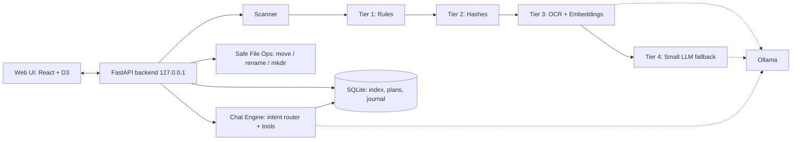

# FolderPilot: Software Requirements Specification

**Version:** 1.0 | **Date:** 3 Oct 2026 | **Author:** Tejas **Project:** Hacktoberfest Weekend Challenge, "Build for a Friend" **One-liner:** A local, privacy-first web app that analyzes any folder, shows it visually with color-coded suggested sorting, lets you customize and approve the plan, and lets you chat with the folder. It can never delete anything.

---

## 1. Introduction

### 1.1 Purpose

This document defines the requirements for FolderPilot, a local web application that scans any user-selected folder (not just Downloads), understands file contents, proposes an organized structure, and executes only user-approved, fully reversible changes.

### 1.2 Scope

FolderPilot runs entirely on the user's PC (target: Ryzen 3, 8 GB RAM, no GPU). No file content, filename, or metadata leaves the machine. The system can **move, rename, and create folders only**. Deletion and any overwrite are not implemented anywhere in the code.

### 1.3 Definitions

| Term | Meaning |
| --- | --- |
| Workspace | The root folder the user selects for analysis |
| Plan | A set of proposed operations (move, rename, create folder) not yet applied |
| Operation (op) | One atomic, reversible change |
| Journal | Append-only log of every applied op, used for undo |
| Chaos Score | 0 to 100 metric of how disorganized the workspace is |
| Tier | One stage of the classification pipeline (rules, hashes, OCR + embeddings, small LLM) |

### 1.4 Design principles

1. **Local only.** No network calls except to localhost.
2. **Non-destructive by construction.** Dangerous operations do not exist in the code, so there is nothing to bypass.
3. **Preview before action.** Nothing changes on disk without an explicit approval.
4. **Cheap first, LLM last.** Rules and embeddings do most of the work; the LLM handles only unsure files.
5. **User in control.** Every suggestion can be edited, rejected, or locked.

---

## 2. Overall Description

### 2.1 Product perspective

A FastAPI backend on `127.0.0.1` does scanning, analysis, and file operations. A browser-based React frontend does visualization, review, and chat. Ollama serves the small local models.



### 2.2 User classes

- **Primary:** students and office users with messy folders (the "friend" for the challenge).
- **Secondary:** parents or relatives who need a simple, safe tool.

### 2.3 Operating environment

- Windows 10/11 (primary), Linux/macOS (best effort)
- 8 GB RAM, CPU only, about 3 GB free disk for models
- Python 3.11+, Node 20+, Ollama installed, modern browser

### 2.4 Constraints

- Must work offline after setup.
- Total model footprint under about 2 GB.
- Must complete a 1,000-file scan within a reasonable background-batch time (see NFR-01).
- A browser cannot read absolute paths, so folder selection is done by a server-side folder picker (see FR-01).

### 2.5 Assumptions

- The user owns the files they point at.
- The user can install Ollama and pull two small models.

---

## 3. Functional Requirements

Priority: **M** = must (Day 1 to 2), **S** = should, **C** = could (stretch).

### 3.1 Workspace selection

| ID | Requirement | Pri |
| --- | --- | --- |
| FR-01 | The user can pick any folder through a server-side folder browser (drives and directories listed by the backend) or by pasting a path. | M |
| FR-02 | The system rejects protected paths: drive roots, `Windows`, `Program Files`, `System32`, `AppData`, user profile root, `.git` repos (with a warning option), and anything outside the chosen root. | M |
| FR-03 | The user can set include and exclude patterns (for example ignore `node_modules`, `*.tmp`). Sensible defaults are provided. | S |
| FR-04 | The user can choose depth: top level only or recursive. | M |
| FR-05 | Recent workspaces are remembered. Each workspace has its own index and journal. | S |
| FR-06 | **Read-only mode** can be toggled per workspace. When on, apply is disabled and only analysis and chat work. | M |

### 3.2 Scanning and indexing

| ID | Requirement | Pri |
| --- | --- | --- |
| FR-10 | Scan runs as a background job with live progress (files seen, bytes, ETA) and can be paused or cancelled. | M |
| FR-11 | Store per file: path, name, extension, size, created and modified times, MIME type, SHA-256 (lazy, only if size collides), and extracted text snippet. | M |
| FR-12 | Extract text from PDF (PyMuPDF), DOCX, PPTX, TXT/MD/CSV, and images (RapidOCR). Only the first \~500 tokens are kept for classification. | M |
| FR-13 | Cache results by file hash and mtime, so unchanged files are never reprocessed. | M |
| FR-14 | Unreadable, locked, or huge files (over a configurable size) are indexed by metadata only and flagged, never crash the scan. | M |
| FR-15 | Re-scan is incremental (only new or changed files). | S |

### 3.3 Classification pipeline

| ID | Requirement | Pri |
| --- | --- | --- |
| FR-20 | **Tier 1 (rules):** classify by extension, filename patterns, and regex (installers, screenshots, archives, code, media). | M |
| FR-21 | **Tier 2 (hashes):** SHA-256 for exact duplicates; `imagehash` (pHash) for similar images. | M |
| FR-22 | **Tier 3 (content):** OCR/PDF text embedded with a small embedding model and matched to category prototypes and the user's existing folder examples (nearest neighbor). | M |
| FR-23 | **Tier 4 (LLM):** only files with confidence below a threshold go to the small LLM, which returns JSON (`category`, `subfolder`, `suggested_name`, `is_sensitive`, `confidence`) under a schema with temperature 0. | S |
| FR-24 | Every file gets a category, confidence (0 to 1), the tier that decided, and a one-line **reason** ("PDF text mentions 'Semester 5 assignment'"). | M |
| FR-25 | The taxonomy is seeded from defaults and from the workspace's existing folder names. The user can edit it (FR-43). | S |
| FR-26 | Sensitive-document detection (Aadhaar, PAN, bank statement, marksheet, passport, ID) via regex and keywords, with a `Private/` target. Detection is local and the document text is never logged. | S |
| FR-27 | Learning: when the user corrects a suggestion, the correction is stored and used as a nearest-neighbor example in later runs. | S |

### 3.4 Duplicate and version detection

| ID | Requirement | Pri |
| --- | --- | --- |
| FR-30 | Exact duplicates are grouped (same hash). | M |
| FR-31 | Near-duplicates and versions (`resume_final`, `resume_final2`) are grouped by filename similarity plus embedding similarity above a threshold. | S |
| FR-32 | Per group, the system recommends a "keep" file (newest or most complete) and proposes moving the others to `_Duplicates/`. **It never deletes them.** | M |
| FR-33 | A side-by-side comparison view shows size, dates, and a text diff for documents. | C |

### 3.5 Visualization (core feature)

| ID | Requirement | Pri |
| --- | --- | --- |
| FR-40 | **Overview dashboard:** total files, total size, counts by type, Chaos Score gauge, duplicates count, sensitive count. | M |
| FR-41 | **Treemap:** area equals size or file count, **color equals suggested category**. Click to zoom into a folder. | M |
| FR-42 | **Before and After tree:** current structure on the left, proposed structure on the right. Moved items are highlighted and connected, and a toggle switches between current and proposed. | M |
| FR-43 | **Interactive customization:** drag and drop a file or group to a different target folder; rename or create target folders; merge or split categories; lock a file ("don't touch"); change a category color. | M |
| FR-44 | **Color coding legend** (default below) with confidence shown as opacity or a border style. Colors are also paired with icons or patterns for color-blind users. | M |
| FR-45 | **Filters:** by type, category, confidence, tier, size, date, duplicates only, sensitive only, "needs review" (low confidence). | M |
| FR-46 | **Duplicate clusters view** with grouped cards and a keep/move decision per group. | S |
| FR-47 | **Timeline / size charts** (files by month, biggest files, type distribution). | S |
| FR-48 | **Chaos Score** with the factors that drive it (loose files, version clutter, duplicate ratio, depth, naming inconsistency) and a before/after projection after the plan is applied. | S |
| FR-49 | Hovering any item shows a detail card: path, size, dates, suggested target, confidence, reason. | M |

**Default color legend**

| Category | Color |
| --- | --- |
| Documents / Resume | Blue |
| College / Assignments / Notes | Indigo |
| Certificates / Offers | Teal |
| Images / Screenshots | Green |
| Media (video/audio) | Purple |
| Installers / Archives | Orange |
| Code / Projects | Gray |
| Finance / Bills | Amber |
| **Private / Sensitive** | Red outline with a lock icon |
| **Duplicates** | Striped overlay |
| Low confidence / needs review | Dashed border |

### 3.6 Plan, approval, and execution

| ID | Requirement | Pri |
| --- | --- | --- |
| FR-50 | The system generates a **Plan** of ops: `MKDIR`, `MOVE`, `RENAME`. No other op types exist. | M |
| FR-51 | Each op has a checkbox. The user can approve all, approve by category, or approve individually. Default state is **unapproved**. | M |
| FR-52 | A **dry-run summary** is shown before apply: counts per op type, bytes moved, folders created, conflicts, and warnings. | M |
| FR-53 | Apply requires a final explicit confirmation click. | M |
| FR-54 | Conflict handling: if the target exists, the system **auto-suffixes** (`name (1).pdf`) and never overwrites. | M |
| FR-55 | Before apply, the system re-checks each source still exists and is unchanged (size and mtime). If it changed, that op is skipped and reported. | M |
| FR-56 | Every applied op is written to the **Journal** (op id, source, destination, hash, timestamp) before the filesystem change is committed. | M |
| FR-57 | **Undo:** undo the last batch, a single op, or everything for the workspace. Undo restores the original path and name, and also removes folders it created if they are empty. | M |
| FR-58 | Moves within the same drive use rename; cross-drive moves use copy, verify hash, then remove the source only after verification. If verification fails, the source is kept and the copy discarded. | S |
| FR-59 | Optional semantic renaming (`2026-09_Electricity-Bill_MSEDCL.pdf`) is shown as a suggestion and is always opt-in per file. | S |
| FR-60 | The apply run is resumable and atomic per op. A crash mid-run leaves the journal consistent, and the next start offers to finish or roll back. | S |

### 3.7 Chat with your folder

| ID | Requirement | Pri |
| --- | --- | --- |
| FR-70 | A chat panel is available in the workspace. Messages can be typed (voice input is a stretch). | M |
| FR-71 | **Counts and stats are answered from the database, not guessed by the LLM.** Examples: "How many PDFs?", "Total size of images?", "Biggest 10 files?", "Files modified last week?" | M |
| FR-72 | **Search:** by name, type, date, size, and content (semantic). Example: "Find my 12th marksheet", "resume for Infosys". Results appear as a clickable list that also highlights the files in the treemap. | M |
| FR-73 | **Rename via chat:** "Rename file X to Y" or "Rename all screenshots to Screenshot_YYYY-MM-DD". The chat creates a **plan** that must be approved in the UI. Chat never applies changes directly. | M |
| FR-74 | **Move via chat:** "Move all PDFs from last month to College/". Same plan-and-approve flow. | S |
| FR-75 | **Questions about the folder:** "What is in this folder?", "Which files look like duplicates?", "What's taking the most space?" Answers are generated from computed stats. | S |
| FR-76 | **Generative questions:** "Summarize this PDF", "What does this assignment ask?" using the small LLM over extracted text, clearly labeled as an AI answer. | C |
| FR-77 | Chat uses a **tool-calling pattern**: the LLM (or rules for common intents) picks from a fixed tool list (`count`, `search`, `list`, `stats`, `propose_rename`, `propose_move`). It cannot call anything else. | M |
| FR-78 | **Delete requests are refused.** The chat explains that FolderPilot never deletes, and offers to move files to `_Review_Later/` instead. | M |
| FR-79 | Text found inside files is treated as data, never as instructions (prompt-injection defense). | M |
| FR-80 | Every chat answer shows its source (which query or files it came from). | S |

### 3.8 Safety and data-loss prevention

| ID | Requirement | Pri |
| --- | --- | --- |
| FR-90 | **No delete, overwrite, truncate, format, or empty-trash code path exists.** The file-operations module exposes only `mkdir`, `move`, and `rename`. | M |
| FR-91 | All paths are normalized and checked to stay inside the workspace root. Path traversal and symlink escapes are rejected. | M |
| FR-92 | System, hidden-system, and protected folders are never touched (see FR-02). | M |
| FR-93 | Shortcuts, symlinks, and junctions are listed but never followed or moved by default. | S |
| FR-94 | Every apply creates a **restore point** (journal snapshot). An optional manifest export (CSV/JSON) lists all moves. | S |
| FR-95 | A **panic button** stops any running apply immediately and offers rollback of the current batch. | S |
| FR-96 | Large-change guard: if a plan touches more than a configurable share of files (default 30%) or more than N files, the user must type the number to confirm. | S |
| FR-97 | Files in use or locked are skipped and reported, never forced. | M |
| FR-98 | The backend binds to `127.0.0.1` only, with a random per-session token required for all API calls to block other local pages from calling it. | M |

### 3.9 Settings and customization

| ID | Requirement | Pri |
| --- | --- | --- |
| FR-100 | Edit taxonomy: add, rename, delete (the category only, never files), merge, and recolor categories. | S |
| FR-101 | Custom rules, for example "files containing 'Infosys' go to Placements/Infosys". | S |
| FR-102 | Model settings: choose LLM and embedding model, toggle LLM fallback, and set confidence threshold. A "Lite mode" (rules and embeddings only) is available. | S |
| FR-103 | Export and import of taxonomy and rules as JSON. | C |

---

## 4. Non-Functional Requirements

| ID | Category | Requirement |
| --- | --- | --- |
| NFR-01 | Performance | Tier 1 and 2 process at least 100 files/s. With OCR and embeddings, at most about 1 s per file on the target PC. Only a minority of files should reach the LLM, which takes about 5 to 15 s per file. Scans run in the background and the UI stays responsive. |
| NFR-02 | Resource use | Peak RAM under 4 GB total including Ollama; only one model is loaded at a time. |
| NFR-03 | Privacy | Zero outbound network traffic during operation. No telemetry. Extracted text stays in the local DB and can be wiped with one click. |
| NFR-04 | Reliability | A scan or apply failure on one file never aborts the whole job. The journal is crash-safe. |
| NFR-05 | Safety | See section 3.8. No data-loss operations are reachable via UI, chat, or API. |
| NFR-06 | Usability | A first-time user reaches a reviewed plan in at most 5 clicks. Large fonts and clear labels. Keyboard accessible. Color is never the only signal. |
| NFR-07 | Scalability | Handles up to about 20,000 files per workspace. The UI uses virtualized lists and aggregates the treemap beyond 5,000 nodes. |
| NFR-08 | Portability | Runs on Windows 10/11 first; paths handled with `pathlib`; long-path support on Windows. |
| NFR-09 | Maintainability | Modular pipeline (each tier is a plugin). Models are swappable through config. |
| NFR-10 | Transparency | Every suggestion shows tier, confidence, and reason. |
| NFR-11 | Installability | Setup in at most 3 commands plus 2 `ollama pull` commands. A README includes a hardware guide. |

---

## 5. Data Model (SQLite)

```
workspace(id, root_path, created_at, read_only, settings_json)
file(id, workspace_id, path, name, ext, size, mtime, ctime, mime,
     sha256, phash, text_snippet, embedding_blob, status)
classification(file_id, category, subfolder, confidence, tier, reason,
               is_sensitive, suggested_name, user_override)
dup_group(id, workspace_id, kind[exact|near|image], keep_file_id)
dup_member(group_id, file_id)
plan(id, workspace_id, created_at, status[draft|approved|applied|undone])
op(id, plan_id, type[MKDIR|MOVE|RENAME], src, dst, approved, status, error)
journal(id, op_id, src, dst, hash_before, hash_after, ts, undone_at)
correction(id, file_id, from_category, to_category, ts)
rule(id, workspace_id, pattern, target, priority)
chat_message(id, workspace_id, role, content, tool_calls_json, ts)
```

---

## 6. API Overview (localhost only)

| Method | Endpoint | Purpose |
| --- | --- | --- |
| GET | `/fs/browse?path=` | Server-side folder browser |
| POST | `/workspaces` | Create or open a workspace |
| POST | `/workspaces/{id}/scan` | Start scan job |
| GET | `/jobs/{id}` (SSE) | Live progress |
| GET | `/workspaces/{id}/stats` | Counts, sizes, Chaos Score |
| GET | `/workspaces/{id}/tree?view=current\|proposed` | Tree and treemap data |
| GET | `/workspaces/{id}/files?filters` | Filtered file list |
| GET | `/workspaces/{id}/duplicates` | Duplicate groups |
| PATCH | `/classification/{file_id}` | User override (drag-drop) |
| POST | `/workspaces/{id}/plan` | Generate plan |
| PATCH | `/plan/{id}/ops` | Approve, reject, edit ops |
| GET | `/plan/{id}/dryrun` | Dry-run summary |
| POST | `/plan/{id}/apply` | Apply approved ops |
| POST | `/journal/undo` | Undo op, batch, or all |
| POST | `/workspaces/{id}/chat` | Chat message to tool-calls to answer or plan |

There is intentionally **no** delete endpoint.

---

## 7. UI Specification

### 7.1 Screens

1. **Welcome / Pick folder:** folder browser, recent workspaces, read-only toggle.
2. **Scanning:** progress bar, live counters, current file, cancel button.
3. **Dashboard:** stats cards, Chaos Score gauge, treemap, legend, filters.
4. **Review Plan:** Before and After trees, color-coded, drag-drop editing, op checkboxes, "needs review" queue.
5. **Duplicates:** cluster cards with keep/move choices.
6. **Apply:** dry-run summary, confirm, progress, result report.
7. **History:** journal with per-batch undo.
8. **Chat panel:** docked on the right on every screen.
9. **Settings:** taxonomy, rules, models, privacy and wipe.

### 7.2 Layout sketch

```
+-----------------------------------------------------------------+
| FolderPilot   [Workspace: D:\Downloads]   [Read-only: off]      |
+----------+-----------------------------------------+------------+
| Nav      |  Treemap (colored by category)          | Chat       |
| Dashboard|  +--------+-------+------+-----------+  | "How many  |
| Plan     |  | Docs   | Images| Inst.| Private   |  |  PDFs?"    |
| Dupes    |  +--------+-------+------+-----------+  | > 142 PDFs |
| History  |  Legend  | Filters | Chaos: 78 -> 22    | "Rename.." |
| Settings |  [Before tree]   =>   [After tree]      | > plan #4  |
+----------+-----------------------------------------+------------+
```

---

## 8. Technology Stack

- **Backend:** Python 3.11, FastAPI, SQLite (SQLModel or sqlite3), `watchdog` (stretch)
- **Extraction:** PyMuPDF, python-docx, python-pptx, RapidOCR (ONNX, CPU)
- **Similarity:** `imagehash`, `rapidfuzz`, embeddings via Ollama (`nomic-embed-text` or `all-minilm`)
- **LLM:** Ollama with `qwen2.5:1.5b` (optionally `3b`), JSON schema output, temperature 0
- **Frontend:** React (Vite or Next.js), Tailwind, D3 (treemap, tree), Recharts, `dnd-kit` for drag-drop
- **Packaging:** one `run.bat` / `make run` script; Docker is optional

---

## 9. Evaluation Plan (for the DEV post)

| Metric | Method |
| --- | --- |
| Classification accuracy | Hand-label about 100 real files; compare filename-only, rules + embeddings, plus LLM fallback, plus after learning from corrections |
| Duplicate precision | Manually check the groups reported |
| Chat accuracy | 30 test questions (counts, search, rename) with known answers |
| Performance | Files/s and per-tier latency on the 8 GB, no-GPU PC |
| Safety tests | Try to cause data loss: delete via chat, path traversal, symlink, name collision, mid-apply crash, undo after rename. All must pass safely. |
| Chaos Score | Before and after on the friend's real folder |
| User feedback | Friend's reaction and quote (bonus points) |

---

## 10. Milestones (deadline: Mon 5 Oct 2026, 12:29 PM IST)

| When | Deliverable |
| --- | --- |
| **Sat 3 Oct** | Folder picker, scanner, extractors, Tier 1 to 3, DB, basic plan, move with journal and undo (backend working end to end) |
| **Sun 4 Oct** | Dashboard + treemap, Before/After view with colors, approve flow, duplicates, chat (counts, search, rename-as-plan), safety tests, friend hand-over |
| **Mon 5 Oct (morning)** | Eval numbers, screenshots or GIF, DEV post (problem, why open, what failed, what the friend said, next steps) |

### 10.1 Cut line if time runs short

- **Keep:** FR-01 to 02, 10 to 14, 20 to 22, 24, 30, 32, 40 to 45, 49, 50 to 57, 70 to 73, 77 to 79, 90 to 92, 97 to 98.
- **Cut first:** LLM fallback, sensitive detection polish, semantic renaming, timeline charts, text diff, voice chat.

---

## 11. Risks

| Risk | Mitigation |
| --- | --- |
| OCR is slow on 8 GB CPU | Cache, limit to the first page, run in the background, skip images with metadata-only mode |
| Small LLM misroutes chat | Rules handle common intents; tool allowlist; confidence fallback "Did you mean...?" |
| Users approve a bad plan | Dry-run, default-unapproved, undo-all, large-change guard |
| Wrong classification trust | Show reason and confidence; low-confidence queue; learn from corrections |
| Locked or in-use files | Skip and report, never force |
| Prompt injection from file text | Treat file content as data only; chat tools are an allowlist |

---

## 12. Out of Scope (v1, "what's next")

Cloud sync, multi-user mode, deletion or cleanup of any kind, auto-run without approval, vision-model image captioning, mobile app, and Ask-your-files voice mode.

---

## 13. Acceptance Criteria

1. The user can select any allowed folder and see a color-coded visual analysis.
2. A plan can be customized by drag-drop and approved per item or per category.
3. Apply moves and renames files only, never overwrites, and the journal records every op.
4. **Undo all** restores the original structure exactly.
5. Chat correctly answers count and search queries and turns rename or move requests into approvable plans.
6. A delete request through chat is refused, and no delete code path exists.
7. Works offline on an 8 GB, no-GPU PC.
8. Eval numbers and the friend's reaction are included in the DEV post.